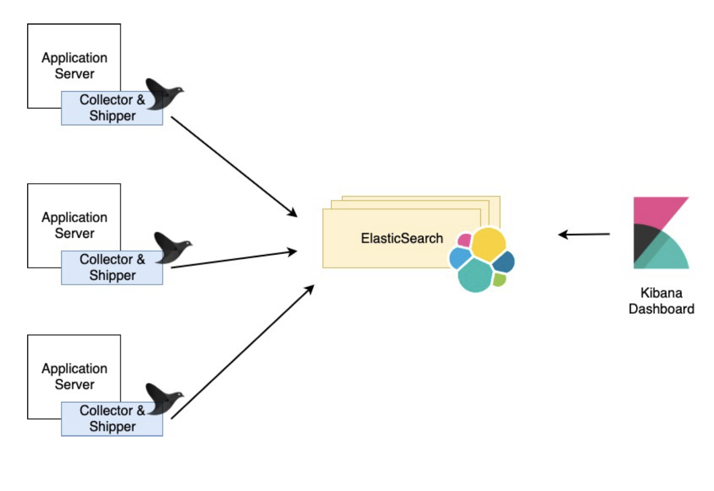

# FEK Logs
Fluentd, Elascticsearch & Kibana

## Architecture Reference
<p align="center">
  
</p>

## Deployment Order
```yaml
kubectl apply -f elasticsearch/
kubectl apply -f kibana/
kubectl apply -f fluentd/
```
